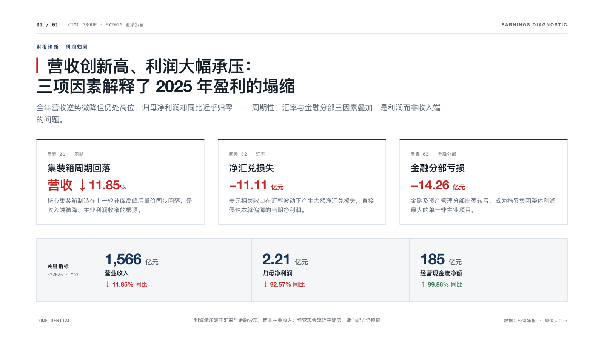
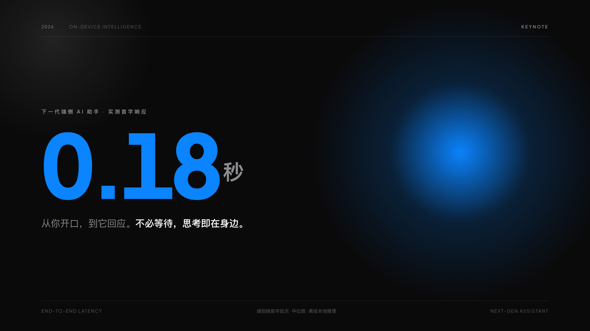
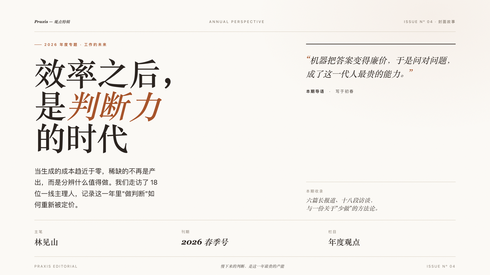
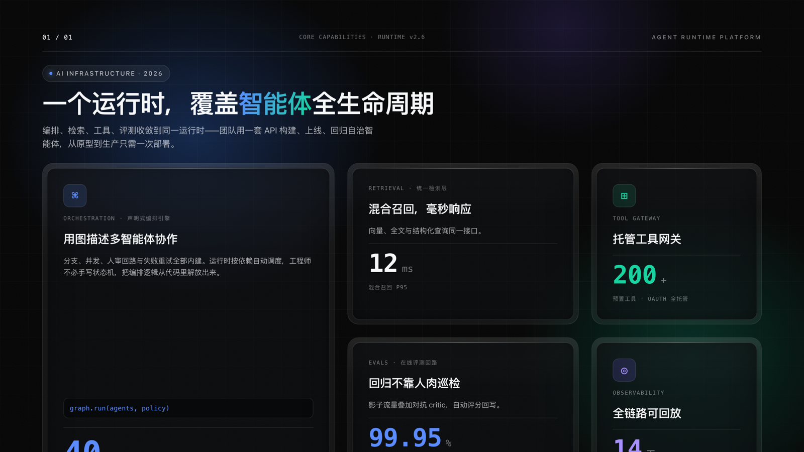

<div align="center">

# alanppt

### 一个 Skill，四种顶级视觉身份的 PPT

**先读场景 · 再选身份 · 呼吸优先 · 换眼视觉 QA**

不是"一种模板套所有"，而是四套自洽、互不混搭的设计系统——
咨询汇报、产品发布、品牌观点、科技产品，按客户需求一键切换。

[](./LICENSE)
[](./references/design-identities.md)
[](#-三种输出格式)
[-C62828?style=flat-square)](#-署名与二次开发)

</div>

---

## 🎨 四种风格 · 一眼看懂

> 同一个 skill，四种截然不同的顶级视觉语言。下面四张均由本 skill 生成、并经"换眼视觉 QA"逐张挑刺修订。

|  |  |
|:--:|:--:|
| **A · 咨询风** <br> <sub>客户汇报 / 尽调 / 董事会 · McKinsey/BCG</sub> | **B · Keynote 发布会风** <br> <sub>产品发布 / 路演 / 主题演讲 · Apple Keynote</sub> |
|  |  |
| **C · Editorial 杂志风** <br> <sub>品牌故事 / 观点 / 行业报告 · Editorial Luxury</sub> | **D · Dark-tech 玻璃风** <br> <sub>AI / 科技产品 / 技术发布 · Linear/Vercel</sub> |
|  |  |

---

## 💡 为什么不是"一种风格打天下"

大多数 AI 生成的 PPT 一看就"塌"——千篇一律的模板、填满版面的拥挤、AI 默认的紫渐变。
alanppt 解决三件事：

- **选对风格**：开工前先做一行 **Design Read**，判断这份该用哪个身份（默认 A 最稳），而不是无脑套默认。
- **做出高级感**：四套设计系统各有自己的字体、配色、装饰与动效配方，且明令避开 LLM 默认审美（反 slop）。
- **不翻车**：两条贯穿四身份的铁律——**呼吸优先**（留白 ≥30%、不挤满）与**换眼视觉 QA**（渲染成图、换一双"新眼睛"挑刺、修完重验）。

## ✨ 四种视觉身份

| | 身份 | 适用场景 | 气质 |
|---|---|---|---|
| **A** | 咨询风 Consulting | 客户汇报 / 尽调 / 董事会 / IPO | 克制、无装饰、结论先行、网格至上 |
| **B** | Keynote 发布会风 | 产品发布 / 路演 / Demo Day / 主题演讲 | 深色、超大字、macro 留白、柔光 |
| **C** | Editorial 杂志风 | 品牌故事 / 观点内容 / 行业报告 | 衬线大标、暖调、颗粒、编辑式排版 |
| **D** | Dark-tech 玻璃风 | AI / 科技产品 / 技术发布 | OLED 黑、网格渐变、玻璃质感、几何 Grotesk |

> 四身份**互不混搭**——咨询风的克制绝不掺玻璃渐变，发布会风的留白绝不塞咨询密度。配方详见 [`references/design-identities.md`](./references/design-identities.md)。

## 🎯 三种输出格式

| 格式 | 输出 | 何时用 |
|---|---|---|
| **HTML 网页 deck** | 单文件 HTML（横向翻页，四身份均可） | 内部分享 / 发链接预览 / Demo Day / 演讲 |
| **可编辑 pptx** | .pptx（PowerPoint 二次编辑） | 客户咨询交付 / 高管展示 / 对方要继续改 |
| **多平台封面** | 单张图片（21:9 / 1:1 / 3:4 / 16:9 / 9:16） | 公众号 / 朋友圈 / 小红书 / 视频号 / 短视频 |

## 🚀 快速使用

对 Claude 说一句即可，skill 会自动做 Design Read → 选身份 → 套模板 → 守呼吸 → 交付前换眼 QA：

```
"做个咨询汇报 PPT"          → A 咨询风
"做个产品发布 keynote"       → B 发布会风
"做个品牌观点页 / 杂志风"     → C 编辑风
"做个 AI 产品介绍 deck"      → D 科技风
"做个公众号头图 / 小红书封面"  → 多平台封面
```

## 🫁 两条质量铁律（贯穿四身份）

- **呼吸优先**：留白是默认不是浪费——每页保留 ≥30% 负空间，论点是上限不是目标，正文不顶版边，宁可拆页也不挤满。
- **换眼视觉 QA**：自己写的版面有"预期盲区"，看不出自己挤了。交付前**必须**渲染成图、派一个全新子 agent 挑刺、修完重验。见 [`references/visual-qa.md`](./references/visual-qa.md)。

## 🗂 仓库结构

```
alanppt/
├── SKILL.md                      ← 主文档（Design Read 前门 + 四身份 + 工作流）
├── LICENSE / NOTICE / CITATION.cff  ← CC BY-SA 4.0 + 原创归属（fork 必须保留）
├── assets/
│   ├── template-consulting.html  ← A 咨询风
│   ├── template-keynote.html     ← B Keynote 发布会风
│   ├── template-editorial.html   ← C Editorial 杂志风
│   ├── template-darktech.html    ← D Dark-tech 玻璃风
│   ├── showcase/                 ← 四风格样张（上方画廊）
│   └── mckinsey-pptx/            ← 可编辑 pptx 工作目录
└── references/
    ├── design-identities.md      ← ★ 四身份配方手册（各自宪法）
    ├── layouts-consulting.md     ← A · 10 种 layout 骨架
    ├── visual-qa.md              ← ★ 渲染 + 换眼视觉 QA 回环
    ├── mckinsey-pptx.md / checklist-mckinsey.md / cover-specs.md
```

## 📜 署名与二次开发

本 skill 由 **Alan Lee (BitmanAlan)** 原创，© 2026，以 **[CC BY-SA 4.0](./LICENSE)** 开源。

**你可以**：自由使用、修改、fork、二次开发（含商用）。
**但你必须**（缺一即侵权、授权自动终止）：

1. **署名**原作者 Alan Lee (BitmanAlan)，保留 [`LICENSE`](./LICENSE)、[`NOTICE`](./NOTICE)、[`CITATION.cff`](./CITATION.cff) 与 `SKILL.md` 顶部署名声明，并注明你的改动；
2. 衍生版**同样以 CC BY-SA 4.0 开源**，不得闭源化 / 改用更严格的私有许可；
3. **不得把本作品或其衍生版宣称为你自己的原创**。

> 你能站在它肩膀上继续做，但不能抹掉作者、不能拿去说是你从零做的、不能闭源圈起来卖。

---

<div align="center">
<sub>© 2026 Alan Lee (BitmanAlan) · Licensed under CC BY-SA 4.0 · 原创署名不可移除</sub>
</div>
